# Minority Figures in Technology History

Women, people of color, and LGBTQ folks in technology history.

## Multi-Category
Humans are complicated - some folks fit in more than one of our categories. So we made a new one just for them!

### Edith Windsor (LGBTQ/woman)
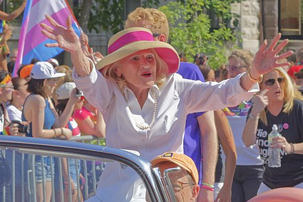
Edith “Edie” Windsor is best known as a gay rights activist who was the lead plaintiff in the landmark Supreme Court Case United States v. Windsor, which overturned Section 3 of the Defense of Marriage Act (DOMA) and led to the legalization of gay marriage. What’s less well known is that Windsor was a computer programmer and an engineer, working with the UNIVAC at Combustion Engineering, Inc., and later at IBM in the 1950s and ’60s, eventually becoming a senior systems engineer.

**[Wikipedia link](https://en.wikipedia.org/wiki/Edith_Windsor)**

### Sophie Wilson (LGBTQ/woman)
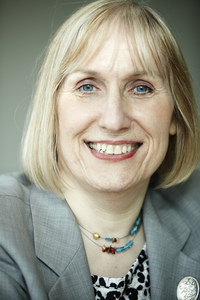
Sophie Wilson studied computer science at Cambridge University, and while on summer vacation she designed a microcomputer used to control feed for cows. In the early days of her career she worked for Acorn Computers, where she contributed to the design of the Acorn System 1, an early 8-bit computer released in 1979, and later the BBC Micro, which proved hugely successful in the UK. Wilson is best known for her development of the Acorn RISC Machine (ARM) processor, still used today in 21st century smartphones. Wilson is a transgender woman.

**[Sophie Wilson: ARM and How Making Things Simpler Made Them Faster & More Efficient](https://hackaday.com/2018/05/08/sophie-wilson-arm-and-how-making-things-simpler-made-them-faster-more-efficient/)**
**[Wikipedia link](https://en.wikipedia.org/wiki/Sophie_Wilson)**
**[Queer a Day: Sophie Wilson](https://queeraday.wordpress.com/2014/03/29/sophie-wilson/)**

### Mary Ann Horton (LGBTQ/woman)
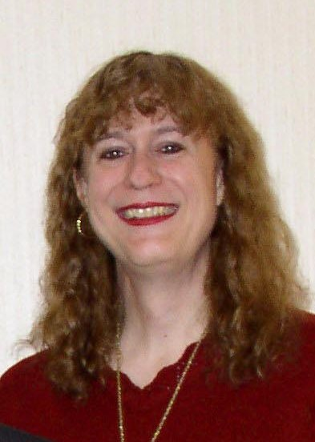
LGBT computer science pioneer earned her Ph.D. in computer science from Berkeley in 1981, where she contributed to the development of Berkeley UNIX, which led to the growth of the Usenet in the 1980s. Horton is a transgender woman who, in addition to her contributions to technology, has also made significant contributions to transgender rights in the workplace. In 1997 she asked her then employer Lucent Technologies to include the language “gender identity, characteristics, or expression” in its Equal Opportunity (EO) nondiscrimination policy, which led to Lucent becoming the first company in the United States to add transgender-inclusive language to its EO policy.

**[Wikipedia link](https://en.wikipedia.org/wiki/Mary_Ann_Horton)**

### Sally Ride  (LGBTQ/woman)
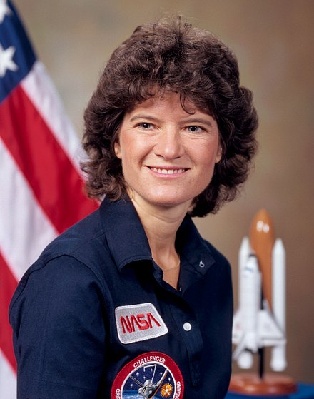
American physicist and astronaut. She joined NASA in 1978 and became the first American woman in space in 1983. After Ride's death, her obituary revealed that her partner of 27 years was Tam O'Shaughnessy. Their relationship was confirmed by her sister, who said she chose to keep her personal life private. She is the first known LGBT astronaut.

**[Wikipedia link](https://en.wikipedia.org/wiki/Sally_Ride)**

### Lynn Conway (LGBTQ/woman)
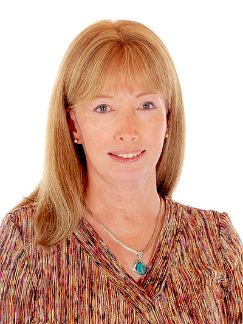
Lynn Conway is an American computer scientist, electrical engineer, inventor, and transgender activist.She is notable for a number of pioneering achievements, including the Mead & Conway revolution in VLSI design, which incubated an emerging electronic design automation industry. She worked at IBM in the 1960s and is credited with the invention of generalized dynamic instruction handling, a key advance used in out-of-order execution, used by most modern computer processors to improve performance.

**[Lynn Conway's homepage](http://ai.eecs.umich.edu/people/conway/conway.html)**
**[Lynn's Story](http://ai.eecs.umich.edu/people/conway/LynnsStory.html)**
**[Wikipedia Link](https://en.wikipedia.org/wiki/Lynn_Conway)**

### Audrey Tang (LGBTQ/person of color/woman)
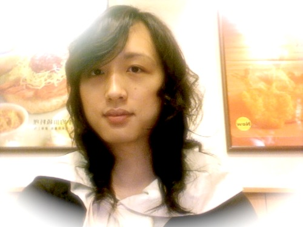
Born in Taiwan, Audrey Tang is a self-taught programmer who was learning Perl at the age of 12, launching a startup at 15, and already working in Silicon Valley by 19. Something of a programming wunderkind, she’s best known for leading the Pugs project to develop the Perl 6 language, starting the Perl Archive Toolkit (PAT), and her role as an outspoken advocate for free software and an open web. A transgender woman, Tang currently devotes most of her energy to political activism and social causes.

**[Wikipedia link](https://en.wikipedia.org/wiki/Audrey_Tang)**
**[Audrey on her gender change](http://pugs.blogs.com/audrey/2005/12/runtime_typecas.html)**

### Mae Jemison (woman of color)
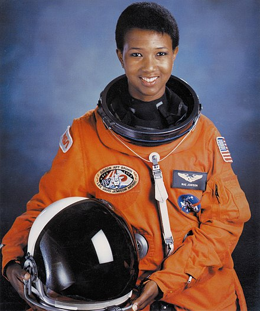
Mae Jemison is an American engineer, physician and NASA astronaut. She became the first African American woman to travel in space when she went into orbit aboard the Space Shuttle Endeavour in 1992.

**[Wikipedia link](https://en.wikipedia.org/wiki/Mae_Jemison)**

### Katherine Johnson, Dorothy Vaughan, Mary Jackson (women of color)
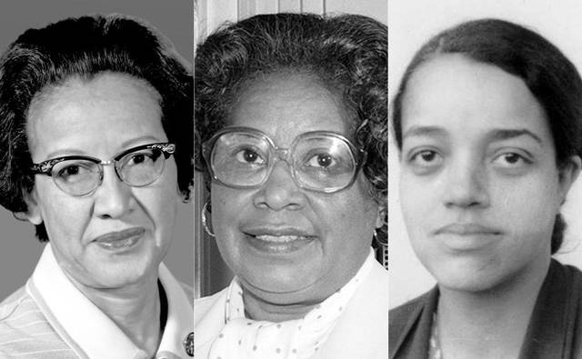
Real life "Hidden Figures," Dorothy Vaughan, Mary Jackson, and Katherine Johnson made notable achievements at NASA, overcoming the many obstacles of the segregated south to work on missions crucial to early space exploration.

* **[They did the math: How NASA's black mathematicians multiplied success](https://edition.cnn.com/2016/12/09/us/hidden-figures-nasa-trnd/index.html)**
* **[Profiles for Black History Month](https://www.illustratedimpact.org/home/2017/2/22/katherine-johnson-dorothy-vaughan-and-mary-jackson)**

## Women

### Ada Lovelace

Augusta Ada King-Noel, Countess of Lovelace (née Byron; 10 December 1815 – 27 November 1852) was an English mathematician and writer, chiefly known for her work on Charles Babbage's proposed mechanical general-purpose computer, the Analytical Engine. She was the first to recognise that the machine had applications beyond pure calculation, and published the first algorithm intended to be carried out by such a machine. As a result, she is sometimes regarded as the first to recognise the full potential of a "computing machine" and the first computer programmer.

**[Wikipedia link](https://en.wikipedia.org/wiki/Ada_Lovelace)**

### Grace Hopper
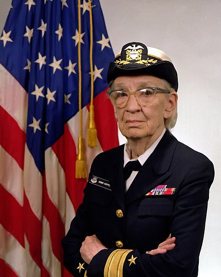
Grace Brewster Murray Hopper was an American computer scientist and United States Navy rear admiral. One of the first programmers of the Harvard Mark I computer, she was a pioneer of computer programming who invented one of the first compiler related tools. She popularized the idea of machine-independent programming languages, which led to the development of COBOL, an early high-level programming language still in use today.

**[Wikipedia link](https://en.wikipedia.org/wiki/Grace_Hopper)**

### Margaret Hamilton
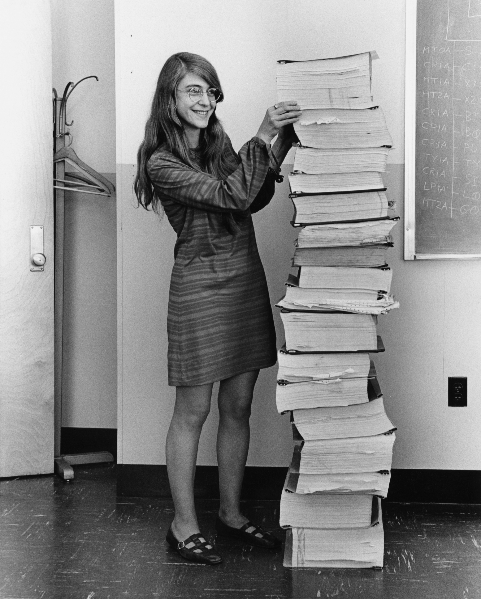
In a field dominated by men, Hamilton was a trailblazer in the field of software engineering — incidentally, a term she coined. She not only played a significant role in making space travel possible, she also forged a decades-long career as a programmer and even founded her own company, Hamilton Technologies, Inc.
 
<strong><a href="https://iq.intel.com/margaret-hamilton-programmed-apollo-11-moon-landing/">How Margaret Hamilton Programmed the Apollo 11 Moon Landing</a></strong> 
<strong><a href="https://en.wikipedia.org/wiki/Margaret_Hamilton_(scientist)">Wikipedia Link</a></strong>

### Hedy Lamarr
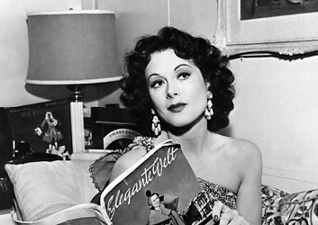
Famous Hollywood actress and inventor. Not only was she known as one of the most beautiful women of her day, but she also invented a technology that enables the mass use of mobile phones and other wireless communications.

**[Wikipedia link](https://en.wikipedia.org/wiki/Hedy_Lamarr#Inventor)**

### Elizabeth Feinler
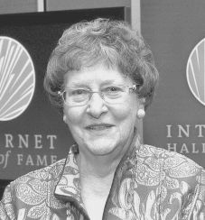
Elizabeth Feinler pioneered and managed first the ARPANET, and then the Defense Data Network (DDN), network information centers (NIC) under contract to the Department of Defense (DoD). Both of these early networks were the forerunners of today’s Internet.

**[Internet Hall of Fame](https://www.internethalloffame.org//inductees/elizabeth-feinler)**

### Radia Perlman
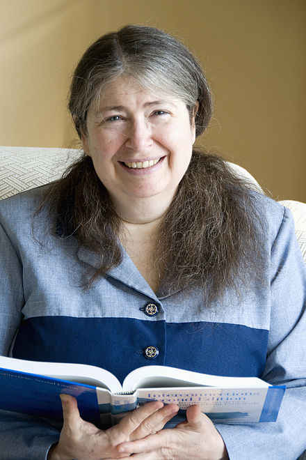
Radia Joy Perlman is an American computer programmer and network engineer. She is most famous for her invention of the spanning-tree protocol (STP), which is fundamental to the operation of network bridges, while working for Digital Equipment Corporation. She also made large contributions to many other areas of network design and standardization, such as link-state routing protocols.

**[Wikipedia link](https://en.wikipedia.org/wiki/Radia_Perlman)**

### Yvonne Marie Andrés
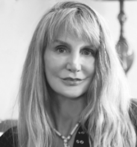
Dr. Yvonne Marie Andrés was one of the earliest people to utilize the Internet to develop and advance global e-learning opportunities for educators and students.

**[Internet Hall of Fame](https://www.internethalloffame.org/inductees/yvonne-marie-andr%C3%A9s)**

### Tracy LaQuey Parker

Former Chief Technology Office of Cisco Systems, where she founded its Worldwide Education focus and Advanced Internet Initiatives, and continued to promote the Internet in academic environments and K-12 schools. She also led Cisco's participation in Internet Society activities internationally. Parker carries the distinction of being the first individual to successfully sue a spammer, who forged her domain name, in a lawsuit that helped to advance legal understanding of the digital frontier.

**[Internet Hall of Fame](https://www.internethalloffame.org/inductees/tracy-laquey-parker)**

## LGBTQ

### Alan Turing
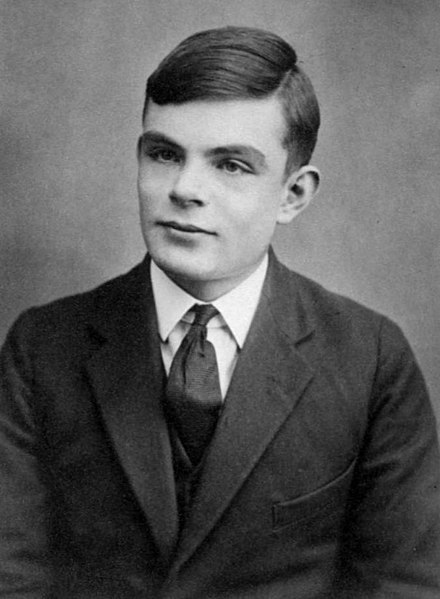
English computer scientist, mathematician, logician, cryptanalyst, philosopher, and theoretical biologist. Turing was highly influential in the development of theoretical computer science, providing a formalisation of the concepts of algorithm and computation with the Turing machine, which can be considered a model of a general purpose computer. Turing is widely considered to be the father of theoretical computer science and artificial intelligence. Turing was prosecuted in 1952 for homosexual acts and accepted chemical castration treatment as an alternative to prison. Turing died in 1954, 16 days before his 42nd birthday, from cyanide poisoning.

**[Wikipedia link](https://en.wikipedia.org/wiki/Alan_Turing)**

### Tim Cook
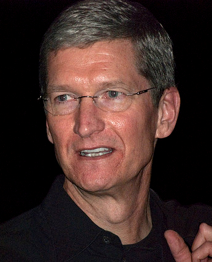
Tim Cook is an American business executive and industrial engineer. Cook is the Chief Executive Officer of Apple Inc., who previously served as the company's Chief Operating Officer, under its founder Steve Jobs. On October 30, 2014, Cook came out as gay, stating "I'm proud to be gay, and I consider being gay among the greatest gifts God has given me." As a result, Cook became the first openly gay CEO on the Fortune 500 list.

**[Wikipedia link](https://en.wikipedia.org/wiki/Tim_Cook)**
**[Tim Cook Explains Why He Came Out as Gay](http://time.com/4036006/tim-cook-coming-out-gay/)**

### Christopher Strachey
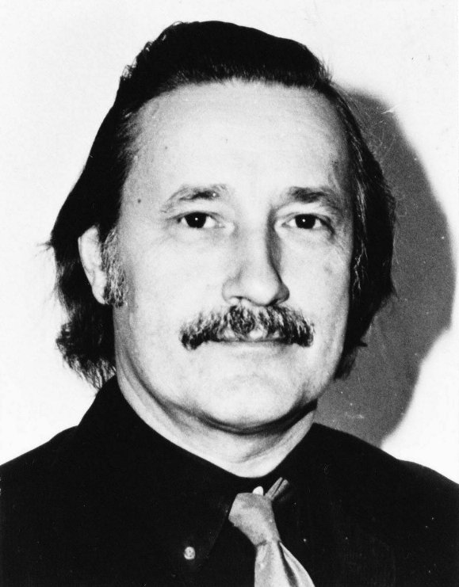
Christopher S. Strachey was a British computer scientist. He was one of the founders of denotational semantics, and a pioneer in programming language design. He was a member of the Strachey family, prominent in government, arts, administration, and academia.

**[Wikipedia link](https://en.wikipedia.org/wiki/Christopher_Strachey)**
**[Short biography](http://rhizome.org/editorial/2013/apr/9/queer-history-computing-part-three/)**

### Peter Landin
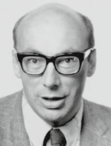
Peter John Landin was a British computer scientist. He was one of the first to realize that the lambda calculus could be used to model a programming language, an insight that is essential to development of both functional programming and denotational semantics. Landin, who was bisexual, became involved with the Gay Liberation Front (GLF) during the early 1970s.

**[Wikipedia link](https://en.wikipedia.org/wiki/Peter_Landin)**

### Jon "maddog" Hall
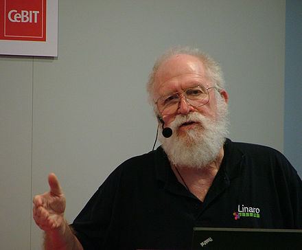
Jon "maddog" Hall is the Board Chair for the Linux Professional Institute, and CEO of OptDyn, makers of Subutai P2P Cloud Platform. In June 2012, in honor of Alan Turing, Hall published an article in Linux Magazine announcing that he is gay.

**[Wikipedia link](https://en.wikipedia.org/wiki/Jon_Hall_%28programmer%29)**
**[OUT in IT: Jon “maddog” Hall opens up about being in OUT](https://www.usenix.org/blog/out-it-jon-%E2%80%9Cmaddog%E2%80%9D-hall-opens-about-being-out)**

## People of Color
*The term "person of color" is used primarily in the United States to describe any person who is not white.*

### Frank Greene
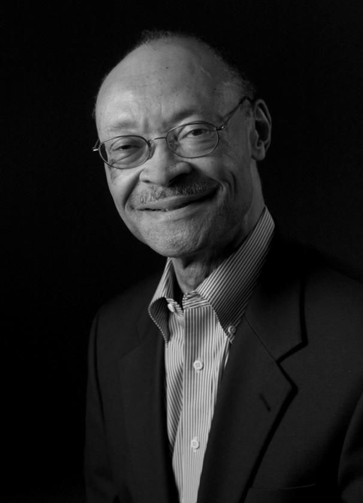
Developed high-speed semiconductor computer-memory systems at Fairchild Semiconductor R&D Labs in the 1960s. He started two technology companies and later founded NewVista Capital, a venture firm with a special focus on minority- and female-headed firms.

**[Obiturary](https://www.paloaltoonline.com/news/2009/12/28/frank-greene-silicon-valley-technology-pioneer-dies-at-71)**

### Roy Clay Sr
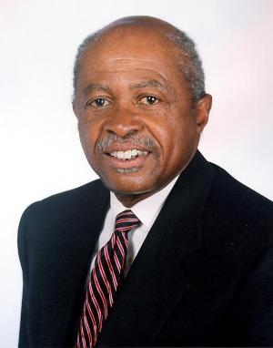
Roy Clay Sr. is known as the Godfather of Silicon Valley. Mr.Clay was at the cutting edge of computing and technology before Microsoft and Apple were ever dreamed of. Clay was writing code even before the emergence of the civil rights era. In 1963 he was employed by Control Data Corporation working on a computer language known as Fortran. For us laymen Fortran is a general-purpose, imperative programming language that is especially suited to numeric computation and scientific computing. Word of Clay’s work got back to David Packard co-founder of Hewlett-Packard and in 1965 he recruited Clay to set up HP’s computer development business. Packard’s idea was to build computers that worked with other HP instrumentation products. Clay was vital to this effort because Packard knew almost nothing about software.

**[African American Cyber Report Profile](http://africanamericancyberreport.com/2015/02/roy-clay-sr-godfather-silicon-valley/)**
**[Mercury News: How a Silicon Valley tech pioneer came close to being Michael Brown](https://www.mercurynews.com/2014/08/28/roy-l-clay-sr-how-a-silicon-valley-tech-pioneer-came-close-to-being-michael-brown/)**

### Mark Dean

### Guion Bluford Jr

### Mae Jemison

### James E West

### Philip Emeagwali

### Kennedy Reed

### Gerald Lawson

### Wanda Austin

### Lester Lyles

### Herman Chinery-Hesse
https://edition.cnn.com/2012/01/26/tech/herman-chinery-hesse-technology/index.html

### Satya Nadella

### Sundar Pichai

## Reference Links

### Multiple Categories

* https://edition.cnn.com/2016/12/09/us/hidden-figures-nasa-trnd/index.html
* [Women and People of Color who Invented the Internet](http://msmagazine.com/blog/2012/06/04/the-women-and-people-of-color-who-invented-the-internet/)

### Women
* [Women in Tech at Wikipedia](https://en.wikipedia.org/wiki/Category:Women_in_technology)

### LGBTQ

* http://www.algbtical.org/2A%20SCIENCE.htm
* https://blog.newrelic.com/2016/06/23/10-lgbt-computer-science-pioneers/
* https://www.noglstp.org/publications-documents/queer-scientists-of-historical-note/
* http://www.ibtimes.com/queer-science-alan-turing-sally-ride-734205

### People of Color

* https://www.eetimes.com/author.asp?section_id=36&doc_id=1331908
* https://prezi.com/ktdqtqyascp0/people-of-color-in-computing/
* https://mashable.com/2013/02/03/black-innovators/

## Submission Guidelines

* Ensure the figure is notable. [Use the Wikipedia guidelines](https://en.wikipedia.org/wiki/Wikipedia:Notability). We don't want to list your neighbor Nancy who happens to fix PCs in her spare time! ;)
* For LGBTQ figures, please ensure they are historical or publically "out"
* For figures who fit into several categories - I have no idea yet
* Please order figures alphabetically by surname